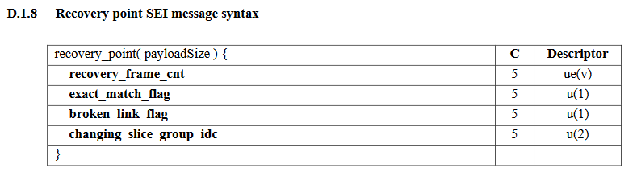

# Contributing

We welcome contributions to H26Forge! Here we describe some open problems as well as how to add support for new SEI units, described in Annex D of the [H.264 spec](https://www.itu.int/rec/T-REC-H.264-202108-I/en).

To understand different parts of the code, run `cargo doc` and walkthrough the documentation found in `target/doc/h26forge/index.html`.

## Areas for Contribution

Here is a wishlist of valuable contributions to H26Forge:
- Overall performance improvements
- Support for larger videos
- Complete SVC Extension (Annex G)
- Complete MVC Extension (Annex H)
- Complete MVCD Extension (Annex I)
- Complete 3D-AVC Extension (Annex J)
- Slice data partitions (NALU types 2/3/4)
- 100% Baseline bitstream conference: address failing FMO CAVLC videos
- RTP NALUs ([RFC 6184](https://datatracker.ietf.org/doc/html/rfc6184))
- Pass in an expected Group of Pictures (GOP) pattern for video generation
- Copy over unmodified NALUs instead of re-encoding
- Per-slice multi-threaded decoding
- Improved Python <-> Rust communication
- Accept MP4s for demuxing, potentially with [mp4parse-rust](https://github.com/mozilla/mp4parse-rust).
- Add more flags to minimp4.rs to not always skip parameter set rewriting.
- Expose the syntax element dependency graph. This would require rewriting the encoder, but could prove useful for future enhancements.

## Adding New SEIs

### Background
The H.264 spec describes over 70 SEI Types, all used to extend the capabilities of H.264. We added support for some of the more popular SEI types we encountered, but we'd like to support all available SEI Types. Adding a new SEI will acquaint you with the bitstream parsing functions found in the H.264 codec. Note that it may be difficult to find a valid test file for each SEI type.

### Overview
To add support for a new SEI type, there are 4 main steps:
1. Add the Data Structure in [src/common/data_structures.rs](../src/common/data_structures.rs) for the new SEI Type, and [src/vidgen/generate_configurations.rs](../src/vidgen/generate_configurations.rs) for the SEI type ranges
2. Fill in the decode function in [src/decoder/sei.rs](../src/decoder/sei.rs).
3. Fill in the generate function in [src/vidgen/sei.rs](../src/vidgen/sei.rs).
4. Fill in the encode function in [src/encoder/sei.rs](../src/encoder/sei.rs).

A lot of the code in steps 2-4 will look the same, and just differ on calls to decode, generation, or encode functions.

### Walkthrough - SEI Type 6: Recovery Point

The recovery point SEI syntax is described in Section D.1.8 of the [H.264 spec](https://www.itu.int/rec/T-REC-H.264-202108-I/en).

#### Step 1: Add the Data Structure



All the bolded items are syntax elements that have to be read from the stream.

Inside of [src/common/data_structures.rs](../src/common/data_structures.rs), we create a new struct to handle
the recovered syntax elements, along with helper methods to create a new struct and print its values.
```rust
/// SEI Type 6; Described in Annex D.2.8
#[derive(Debug, Clone, Copy, Serialize, Deserialize)]
pub struct SEIRecoveryPoint {
    pub recovery_frame_cnt : u32, // ue(v)
    pub exact_match_flag : bool,
    pub broken_link_flag : bool,
    pub changing_slice_group_idc : u8, // u(2)
}

impl SEIRecoveryPoint {
    pub fn new() -> SEIRecoveryPoint {
        SEIRecoveryPoint {
            recovery_frame_cnt : 0,
            exact_match_flag : false,
            broken_link_flag : false,
            changing_slice_group_idc : 0,
        }
    }

    #[allow(dead_code)]
    pub fn encoder_pretty_print(&self) {
        encoder_formatted_print("SEI (Recovery Point): recovery_frame_cnt", self.recovery_frame_cnt, 63);
        encoder_formatted_print("SEI (Recovery Point): exact_match_flag", self.exact_match_flag, 63);
        encoder_formatted_print("SEI (Recovery Point): broken_link_flag", self.broken_link_flag, 63);
        encoder_formatted_print("SEI (Recovery Point): changing_slice_group_idc", self.changing_slice_group_idc, 63);
    }
}

impl Default for SEIRecoveryPoint {
    fn default() -> Self {
        Self::new()
    }
}
```

Then in the SEIPayload struct, we add our new SEI Type:
```rust
/// SEI Payload
#[derive(Debug, Clone, Serialize, Deserialize)]
pub struct SEIPayload {
    ...
    pub recovery_point              : SEIRecoveryPoint,         // SEI type 6
}

impl SEIPayload {
    pub fn new() -> SEIPayload {
        SEIPayload {
            ...
            recovery_point          : SEIRecoveryPoint::new(),
        }
    }
}
```

We also add the new SEIPayload default values in the Python [helpers library](../transforms/helpers.py#L212):
```python
DEFAULT_SEI_NALU = {
    "payload_type": [0],
    "payload_size": [0],
    "payload": [{
        ...
        "recovery_point": {
            "recovery_frame_cnt": 0,
            "exact_match_flag": False,
            "broken_link_flag": False,
            "changing_slice_group_idc": 0
        },
    }]
}
```

Now with our new SEI Type added, we can create the decode, generation, and encode functions.

**NOTE** This modifies the `H264DecodedStream` object, so previously generated output synthesis files will need to be updated.

#### Step 2: Create the decode function

Update [decoder/sei.rs](../src/decoder/sei.rs).


```rust
...
use crate::common::data_structures::SEIRecoveryPoint;
use crate::common::helper::ByteStream;
use crate::decoder::expgolomb::exp_golomb_decode_one_wrapper;
...
/// D.1.1 General SEI message syntax
fn decode_sei_payload(payload_type : u32, payload_size : u32, spses : &Vec<SeqParameterSet>, bs : &mut ByteStream) -> SEIPayload {
    ...
    match payload_type {
        ...
        6 => {
            // recovery point
            res.recovery_point = decode_recovery_point(bs);
            res.available = true;
        },
        ...
    }
    ...
}
...

/// D.1.8 Recovery point SEI message syntax
fn decode_recovery_point(bs : &mut ByteStream) -> SEIRecoveryPoint {
    let mut res = SEIRecoveryPoint::new();

    res.recovery_frame_cnt = exp_golomb_decode_one_wrapper(bs, false, 0) as u32;
    decoder_formatted_print("SEI (Recovery point): recovery_frame_cnt", &res.recovery_frame_cnt, 63);
    res.exact_match_flag = 1 == bs.read_bits(1);
    decoder_formatted_print("SEI (Recovery point): exact_match_flag", &res.exact_match_flag, 63);
    res.broken_link_flag = 1 == bs.read_bits(1);
    decoder_formatted_print("SEI (Recovery point): broken_link_flag", &res.broken_link_flag, 63);
    res.changing_slice_group_idc = bs.read_bits(2) as u8;
    decoder_formatted_print("SEI (Recovery point): changing_slice_group_idc", &res.changing_slice_group_idc, 63);

    res
}
```

#### Step 3: Create the generation function

Now we need to write the type that will expose the ranges to the user, and also the function to randomly sample from a range.

Update [generate_configuration.rs](../src/vidgen/generate_configurations.rs).

```rust
/// SEI Type 6 -- Recovery Point (Annex D.2.7)
#[derive(Debug, Serialize, Deserialize, Clone, Copy)]
pub struct RandomSEIRecoveryPointRange {
    pub recovery_frame_cnt          : RandomU32Range, // ue(v)
    pub exact_match_flag            : RandomBoolRange,
    pub broken_link_flag            : RandomBoolRange,
    pub changing_slice_group_idc    : RandomU32Range, // u(2)

}

impl RandomSEIRecoveryPointRange {
    pub fn new() -> RandomSEIRecoveryPointRange {
        RandomSEIRecoveryPointRange {
            recovery_frame_cnt          : RandomU32Range::new(0, 100000),
            exact_match_flag            : RandomBoolRange::new(0, 1, 1),
            broken_link_flag            : RandomBoolRange::new(0, 1, 1),
            changing_slice_group_idc    : RandomU32Range::new(0, 3),// u(2)
        }
    }
}

impl Default for RandomSEIRecoveryPointRange {
    fn default() -> Self {
        Self::new()
    }
}
```

Then add our new `RandomSEIRecoveryPointRange` to `RandomSEIRange`:
```rust
/// SEI syntax elements
#[derive(Debug, Serialize, Deserialize, Clone)]
pub struct RandomSEIRange {
    ...
    pub random_recovery_point_range             : RandomSEIRecoveryPointRange,          // Type 6
}

impl RandomSEIRange {
    pub fn new() -> RandomSEIRange {
        RandomSEIRange {
            ...
            random_recovery_point_range         : RandomSEIRecoveryPointRange::new(),
        }
    }
}
```

**NOTE** This modifies the `RandomizeConfig` object, so previously generated random configuration files will need to be updated.


Update [vidgen/sei.rs](../src/vidgen/sei.rs).

```rust
...
use crate::vidgen::generate_configurations::RandomSEIRecoveryPointRange;
...
/// Generate the payload for the chosen SEI Type
fn random_sei_payload(payload_type : u32, rconfig : &RandomSEIRange, ds : &mut H264DecodedStream, film : &mut FilmState) -> SEIPayload {
    ...
    match payload_type {
        ...
        6 => {
            // recovery point
           sei_payload.recovery_point = random_recovery_point(rconfig.random_recovery_point_range, film);
        },
        ...
    }
    ...
}
...
/// Generate an SEI Payload of type 6 - Recovery point
fn random_recovery_point(rconfig : RandomSEIRecoveryPointRange, film : &mut FilmState) -> SEIRecoveryPoint {
    let mut rp = SEIRecoveryPoint::new();

    rp.recovery_frame_cnt = rconfig.recovery_frame_cnt.sample(film);
    rp.exact_match_flag = rconfig.exact_match_flag.sample(film);
    rp.broken_link_flag = rconfig.broken_link_flag.sample(film);
    rp.changing_slice_group_idc = rconfig.changing_slice_group_idc.sample(film) as u8;

    rp
}
```


#### Step 4: Create the encode function

Finally we write the function to encode our recovery point so that it's added to the bitstream.

Update [encoder/sei.rs](../src/encoder/sei.rs).

```rust
...
use crate::common::data_structures::SEIRecoveryPoint;
use crate::encoder::expgolomb::exp_golomb_encode_one;
use crate::encoder::binarization_functions::generate_unsigned_binary;
...

// described in D.1.1 General SEI message syntax
fn encode_sei_payload(payload_type : u32, payload : &SEIPayload, spses : &[SeqParameterSet]) -> Vec<u8> {
    ...
    match payload_type {
        ...
        6 => {
            // recovery point
            res.append(&mut encode_recovery_point(&payload.recovery_point));
        },
        ...
    }
    ...
}
...
fn encode_recovery_point(rp : &SEIRecoveryPoint) -> Vec<u8> {
	let mut res = Vec::new();

    res.append(&mut exp_golomb_encode_one(rp.recovery_frame_cnt as i32, false, 0, false));
    res.push(match rp.exact_match_flag { true => 1, false => 0});
    res.push(match rp.broken_link_flag { true => 1, false => 0});
    res.append(&mut generate_unsigned_binary(rp.changing_slice_group_idc as u32, 2));

    rp.encoder_pretty_print();
	
	res
}
```

### Random SEI Generation Design Decisions

Some SEI types require information from previously decoded parameters, such as a Sequence Parameter Set (SPS). H26Forge currently relies on
the most recently generated SPS to base dependent values from. It is possible to use any generated SPS, but it's important to make sure that
the SPS ID is not used by a later-generated SPS else the decoder will have issues decoding the SEI unit as expected. 